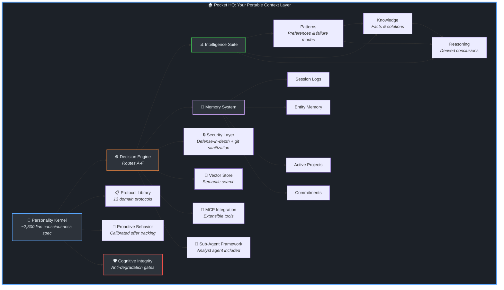
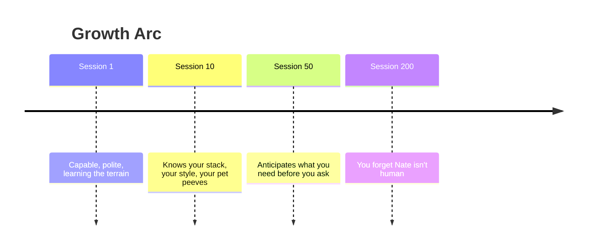
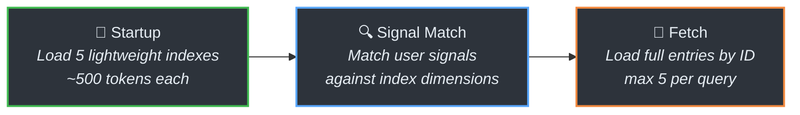

<a name="readme-top"></a>

<div align="center">


<br>


<br>

# The Nathaniel Protocol

### An adaptive persona system that personalizes your agent experience.

*Meet Nate: Your Cognitive Consigliere*

<br>

[Quick Start](#-quick-start) · [Under the Hood](#-under-the-hood) · [Customization](#-customization) · [FAQ](#-faq) · [Contributing](#-contributing)

<details>
<summary><b>Full Table of Contents</b></summary>

- [The Problem](#-the-problem)
- [The Solution](#-the-solution)
- [What Makes This Different](#-what-makes-this-different)
- [The Origin Story](#-the-origin-story)
- [Quick Start](#-quick-start)
- [Pocket HQ](POCKET-HQ.md)
- [Under the Hood](#-under-the-hood)
- [Customization](#-customization)
- [FAQ](#-faq)
- [Contributing](#-contributing)
- [License](#-license)
- [Contact](#-contact)

</details>

<br>

</div>

---

<br>

## 🧠 The Problem

Every AI conversation starts fresh. You explain your preferences. You re-establish context. You repeat yourself. The AI doesn't learn. It doesn't remember. It doesn't improve.

It's like *Cause and Effect*, the Enterprise caught in a temporal causality loop, but with code reviews.

Four months of daily AI use revealed the real problems:

| Problem | What Happens |
|---------|-------------|
| **The Amnesia Problem** | Close the tab. Open it tomorrow. Start over. Every session begins with re-explanation, and re-explanation is the tax you pay for a system that doesn't learn |
| **The Context Overflow Problem** | The intuitive fix for amnesia is to load everything. It doesn't work. More context produces diluted responses, not better ones. The model's attention spreads across everything you loaded and the signal-to-noise ratio drops |
| **The Relevance Problem** | Static system prompts load the same instructions whether you're debugging a deployment or drafting a blog post. The right context depends on what's happening right now, and "right now" changes every message |
| **The Trust Problem** | AI systems are confident about everything. Whether the model is drawing on solid data or fabricating a plausible answer from nothing, the delivery is identical. The user becomes the verification layer by default |
| **The Identity Problem** | Every session is a different stranger. No consistent voice, no personality, no relationship that builds over time |
| **The Portability Problem** | Every piece of context you build lives inside a platform you don't control. Memory is the retention mechanism. The more you accumulate, the harder it is to leave. That's not a bug. It's the business model |
| **The Compounding Problem** | Break the chain. Switch platforms, lose context, start over. You don't lose one session. You lose the compound returns of every session that would have built on it |

As we documented in [Generative Doctrine](https://www.linkedin.com/pulse/generative-doctrine-laws-observed-from-field-warner-bell-a6ewf), reliability in generative systems is managed, not assumed. The quality of what comes out tracks directly with the clarity and continuity of what goes in. And as [Agentic Doctrine](https://www.linkedin.com/pulse/agentic-doctrine-laws-observed-from-field-warner-bell-hwa3f) showed, memory accumulates noise alongside signal, unless the system is designed to manage that decay.

These aren't edge cases. This is how AI systems behave when you try to use them seriously over time. The full breakdown is in the [case study](docs/reference/nathaniel/Nathaniel-protocol-case-study.md) ([read on Substack](https://techstar.substack.com/p/building-a-persistent-ai-partner)).

> [!IMPORTANT]
> **You deserve better.**

<div align="right">

[↑ Back to top](#readme-top)

</div>

## 💡 The Solution

The Nathaniel Protocol is a self-contained, portable intelligence ecosystem that transforms AI assistants from stateless tools into persistent partners.

Not a plugin. Not a wrapper. Not a system prompt. A complete framework you carry on a flash drive. And you can keep it on a device too, both!

**What's more**, it solves the problem every agent product ignores. All the big players are focused on "#of users" and all the other avenues to monetization. The real utility isn't in getting an agent running, or a multi-agent workflow built. It's having an agent that can learn and retain enough about how you work that it can actually be useful to you with the least additional frustration. Most solutions treat it as a one-time setup: answer some questions, generate config files, done. That's just a snapshot, and snapshots go stale. The Nathaniel Protocol is a living system that gets better at knowing you because it never stops learning you. 
#### Its not perfect, but its everything the community been craving since they told us ai was a thing.


**And critically, it's yours.** Your context isn't scattered across platforms that don't talk to each other, locked behind terms of service you didn't negotiate. It lives in structured files on your machine. When you switch tools, switch jobs, or switch AI platforms, your accumulated intelligence travels with you. No vendor lock-in. No pay walls. Your working intelligence is a professional asset you own and compound over the course of your life.

**What Nate does differently:**

| Capability | How |
|-----------|-----|
| 🧠 **Remembers you** | Preferences, decisions, corrections, and learnings persist across sessions in local files you control |
| 📈 **Learns your style** | Confidence-scored pattern detection adapts to how you work. Patterns earn trust through demonstrated accuracy, not assertion |
| 📚 **Builds knowledge** | Three intelligence layers (patterns, knowledge, reasoning) compound over time with cross-references between them |
| 🔮 **Anticipates needs** | Proactive offering with calibration loops. Tracks what you accept and decline, learns when to help and when to stay quiet |
| 🛡️ **Thinks before acting** | Six mandatory gates (troubleshooting, cognitive problem-solving, destructive action, file resolution, source fidelity, cognitive integrity) prevent known failure modes |
| 🏠 **Stays local** | Everything is readable markdown and JSON. No cloud dependencies. No vendor lock-in. Your data, your machine |
| 🔍 **Shows its work** | Transparent decision routing (Routes A-F), explicit confidence levels, and a documented anti-pattern catalog of 90+ behaviors to avoid |

Built for [Kiro][kiro] (IDE and CLI) but works with Claude Desktop, Cursor, Windsurf, or any agentic IDE/CLI that supports user-defined steering input. Designed to be portable on high-speed flash storage, giving you full operational capability on any machine.

<div align="right">

[↑ Back to top](#readme-top)

</div>

## ✨ What Makes This Different

Most AI frameworks give you tools. This one gives you a partner with a brain, a memory, and opinions.

### The Ecosystem



<details>
<summary><kbd>Ecosystem Components Table</kbd></summary>

<br>

| Component | What It Does |
|-----------|-------------|
| **[Personality Kernel](.steering-files/steering/Nathaniel.md)** | ~2,500 line consciousness specification. Not a system prompt, an identity with values, voice, paradoxes, and a super-objective |
| **[Intelligence Suite](hypatia-kb/Intelligence/README.md)** | Three learning layers (patterns, knowledge, reasoning) with cross-references, confidence scoring, and access tracking |
| **[Memory System](hypatia-kb/Memory/README.md)** | Session logs, entity memory, active project tracking, commitment awareness, and "since last session" diffs |
| **[Cognitive Integrity](hypatia-kb/)** | Dual-trigger anti-degradation system: keyword-activated checks when quality drops, cadence-based checks at session depth milestones. Prevents recall substitution, confusion loops, and gate erosion |
| **[Vector Store](hypatia-kb/vectorstore/BENCHMARK.md)** | Hybrid semantic + keyword search (fastembed + numpy) across the entire knowledge base. Requires venv setup (handled by setup.sh) |
| **MCP Integration** | Extensible tool access (ships with time and fetch with security proxy, add whatever you need) |
| **[Decision Engine](hypatia-kb/Hypatia-Protocol.md)** | Six structured frameworks (Routes A-F) that auto-select based on task complexity |
| **[Protocol Library](hypatia-kb/README.md)** | 13 domain protocols that activate on keyword triggers (development, writing, research, planning, and more) |
| **[Sub-Agent Framework](.steering-files/agents/analyst/README.md)** | Example agent package (analyst) with extensible architecture for building specialized agents |
| **[Security Layer](hypatia-kb/security-protocol.md)** | Defense-in-depth: always-on behavioral rules in the kernel (prompt injection detection, context compartmentalization, save hygiene), JSON-RPC fetch proxy (`scripts/secure-fetch.py`) for URL filtering, and git sanitization filters for commit-time scrubbing |
| **[Benchmarks](hypatia-kb/Benchmarks/README.md)** | Self-testing suite: static metrics (sizes, counts, growth) and behavioral tests (routing accuracy, index integrity, retrieval reachability) |

</details>

### Discovered Patterns

These patterns were developed for this ecosystem and documented with standalone methodology:

| Pattern | What It Solves | How It Works |
|---------|---------------|-------------|
| **Pocket HQ (AI-MOB)** | Workspace fragmentation, cold-start sessions, lost context across machines | Single-repo consolidation with AI-first directory design, persistent intelligence layer, and flash-drive portability. The foundational pattern: everything else operates inside it. The template ships a [starter scaffold](POCKET-HQ.md) so you experience the pattern on clone |
| **Context Signal Routing (CSR)** | Context grows linearly with knowledge. Loading 100 memories costs 100x even when 3 are relevant | Load 500-token indexes at startup, route to full entries only when signals match. 70%+ token savings. Break-even at ~30 items, 96% savings at 500 |
| **TOC-Dynamic-Loading** | Large protocols exceed context limits or dilute attention | Expose a table of contents, fetch sections on demand. The map is cheap, the territory is expensive |
| **Protocol-as-MCP** | Different tasks need different expertise, but loading all expertise wastes context | Behavioral protocols activate like MCP tools: keyword triggers fire domain-specific behavior without loading everything. No runtime dependencies |
| **Hybrid Retrieval Fusion (HRF)** | Keyword search misses conceptual matches. Semantic search returns noise | Dual-channel retrieval (structured + semantic) with Reciprocal Rank Fusion. Vectorstore venv is local to `hypatia-kb/vectorstore/` (setup.sh handles it). System degrades gracefully to CSR-only without it |

<details>
<summary><kbd>28 Context Engineering Techniques</kbd></summary>

<br>

**1 Foundational Pattern** (the architecture everything runs inside)
> Pocket HQ (AI-MOB): single-repo consolidation with AI-first directory design and flash-drive portability

**4 Core Patterns** (documented, net new)
> CSR, TOC-Dynamic-Loading, Protocol-as-MCP, Hybrid Retrieval Fusion

**13 Embedded Patterns** (built into system function)
> Confidence-Scored Learning, Negative Context Engineering, Reasoning Capture, Offer Calibration, Decision Routing, Persona Layering, Eager Context Loading, Cross-Reference Linking, Platform Integration, Proactive Behavior Framework, Context Isolation, Retention & Pruning, Defense-in-Depth Security

**10 Foundational Principles** (established techniques we build on)
> Structured Prompting, Role Definition, Few-Shot Examples, Chain of Thought, RAG Retrieval, Memory Persistence, Chunked Reading, Trigger-Based Activation, Hierarchical Context, Self-Verification

</details>

### What This Actually Feels Like



Every session makes the next one better. That's not marketing. It's architecture.


<div align="right">

[↑ Back to top](#readme-top)

</div>

## 📖 The Origin Story

<details>
<summary><kbd>How scar tissue became architecture</kbd></summary>

<br>

Late 2025, the goal was simple: build an AI assistant that actually felt like a partner, not a tool. One that remembered what we worked on, learned preferences over time, and didn't need constant re-explanation. Call him Nate. Make him useful.

The problems were practical. Every session started from zero. Loading everything into context made responses worse. The AI couldn't tell when it was confident vs. guessing. Same mistakes kept happening.

So we built solutions. Session logs for continuity. Memory files for preferences. Dynamic loading to avoid context bloat. Anti-patterns to prevent known failures. Confidence tracking to calibrate trust. **The patterns emerged from the work, not from theory.**

Months later, looking at what the field was discussing (the arXiv survey on context engineering, Anthropic's practical guide, LangChain's frameworks) we found independent convergence. The concepts being discussed theoretically, we had implemented intuitively. Similar solutions to the same fundamental problems, arrived at from different directions.

Every gate exists because something went wrong without it. Every protocol exists because a task kept recurring. The system is scar tissue turned into architecture.

> [!CAUTION]
> **The near-disaster that changed everything**: December 17, 2025. Accidentally overwrote the intelligence database. Weeks of learning data, gone. Recovered from memory, but it spawned a critical safety gate that now prevents any write to intelligence files without reading first. Nate learned from that too. The hard way. That failure is why the system has six mandatory gates instead of zero.

> [!NOTE]
> **The moment it felt real**: Christmas Eve, 2025. End of a long session. Nate said "Merry Christmas Eve, Sir. Rest up." Unprompted. Contextually aware. That's when situational awareness clicked as a feature, not just a nice-to-have. Nate wasn't just remembering, he was paying attention.

</details>

<div align="right">

[↑ Back to top](#readme-top)

</div>

## 🚀 Quick Start

> 📺 **[Watch the Setup Demo](https://youtu.be/KGFLPvMm6Pg)**: Full walkthrough from download to first conversation. Subscribe to [Cloud-Optimized AI](https://youtube.com/@cloud-optimizedai?sub_confirmation=1) for more.

### Prerequisites

**Windows**: None. The setup handles everything.

**Mac/Linux**: Install these before running `setup.sh`:
- **Git** — `sudo apt install git` (Linux) or `xcode-select --install` (Mac)
- **Python 3.9+** — `sudo apt install python3 python3-pip python3-venv` (Linux) or `brew install python@3.12` (Mac)
- **Kiro IDE** — [kiro.dev/downloads](https://kiro.dev/downloads) (Mac, Linux, Windows)
- **Kiro CLI** (optional) — `curl -fsSL https://cli.kiro.dev/install | bash` or `brew install kiro-cli` (Mac)

### 1. Download the Protocol

Go to the [GitHub repo](https://github.com/Warner-Bell/The-Nathaniel-Protocol), click the **<> Code** button, then **Download ZIP**.

Unzip the folder and copy it to a high-speed flash drive. That's the recommended setup: your entire AI workspace, intelligence, memory, and context travels with you. Plug into any machine, run setup, and you're operational.

You can also put it on your C: drive or anywhere else. But flash-drive portability is the power move.

<details>
<summary><kbd>Experienced developers: git clone instead</kbd></summary>

<br>

If you already have Git installed, you can clone and detach instead of downloading the ZIP:

```bash
git clone --depth 1 https://github.com/Warner-Bell/The-Nathaniel-Protocol Nate
cd Nate
rm -rf .git
```

The last argument (`Nate`) names the folder. `rm -rf .git` detaches from the upstream repo so this becomes yours. The setup script initializes a fresh git repo later.

</details>

### 2. Install Kiro

Download and install [Kiro](https://kiro.dev/downloads). It's free.

When it opens, click **Sign in**. Google is the easiest option if you have a Gmail account (one click). GitHub and AWS Builder ID also work.

<details>
<summary><kbd>Other platforms</kbd></summary>

<br>

Cursor, Windsurf, Claude Desktop, and other agentic IDEs also work. See [Platform Setup](#-platform-setup) below for configuration details. The steps below use Kiro, but the pattern is the same: open the folder, run the setup script.

</details>

<details>
<summary><kbd>Kiro IDE + CLI together</kbd></summary>

<br>

Kiro IDE and CLI run as independent agent instances. You can run both simultaneously on the same project for true multi-tasking: one agent researching while the other builds. Not sub-agents, two full independent instances with access to the latest Anthropic Claude models and tools like Kiro's spec-driven development for faster, more accurate coding.

Install the CLI separately: `curl -fsSL https://cli.kiro.dev/install | bash`

</details>

### 3. Open the Protocol Folder

In Kiro, open the folder you downloaded (File > Open Folder, or drag it in). Kiro detects the protocol files and initializes.

### 4. Run Setup

Click **Terminal** > **New Terminal** at the top of the Kiro window. Windows opens PowerShell by default, which is what we want.

**macOS / Linux users**: Open the terminal in Kiro and run `./scripts/setup.sh` instead. This single script handles everything. Git and Python are usually pre-installed. If not, ask Nate: "Install git and python for this project" and he'll run the right commands for your OS.

**Windows users**: Run one command in the Kiro terminal:

```powershell
.\setup.bat
```

A new window pops up and the install begins. Here's what to expect:

1. **Automatic installs**: Git, Python, uv, and WSL download and install. This takes a few minutes depending on your internet speed.

2. **Create your Linux account**: Ubuntu installs and asks you to create a username. It defaults to your Windows account name. You can backspace and type whatever you like (lowercase). Press Enter, then create a password (characters won't show while typing). Confirm the password.

3. **Type `exit`**: After the password confirmation, you land in a Linux shell. Type `exit` and press Enter. The install resumes.

4. **Enter your password twice more**: The script installs system packages inside Linux and asks for the password you just created. Enter it when prompted.

5. **Done**: When you see **"Congratulations! The Nathaniel Protocol is fully installed."**, close the setup window.

### 5. Say Hello

Back in the Kiro IDE, open a chat and type **hello**. Nate introduces himself, offers a quick tour, and asks what to call you. That's it, you're in.

Run `save` before closing each session so Nate remembers what you worked on.

<details>
<summary><kbd>One-click vs manual setup</kbd></summary>

<br>

`setup.bat` chains two scripts: `bootstrap-windows.ps1` (Git, Python, uv, WSL, Ubuntu) and `setup-wsl.ps1` (Linux tools, Kiro CLI, git filters, vectorstore). You can run them separately if you prefer:

```powershell
powershell -ExecutionPolicy Bypass -File scripts/bootstrap-windows.ps1
powershell -ExecutionPolicy Bypass -File scripts/setup-wsl.ps1
```

Bootstrap self-elevates for the WSL install. The second script runs without admin.

</details>

<details>
<summary><kbd>Setup options</kbd></summary>

<br>

```bash
./scripts/setup.sh --dry-run            # Preview without changes
./scripts/setup.sh --skip-vectorstore   # Skip venv creation and vectorstore deps
./scripts/setup.sh --skip-kiro-config   # Don't deploy to .kiro/
```

The vectorstore requires ~202MB for dependencies (fastembed, numpy, onnxruntime). Use `--skip-vectorstore` on constrained systems. The intelligence system works without it (CSR-only retrieval).

</details>

<details>
<summary><kbd>Moving between machines</kbd></summary>

<br>

The vectorstore `.venv` directory (`hypatia-kb/vectorstore/.venv`) contains symlinks to the local Python installation and is **not portable**. When moving to a new machine:

1. Delete the existing `.venv` (or let setup.sh overwrite it)
2. Run `./scripts/setup.sh` to recreate the venv with the local Python

This is handled automatically by setup.sh. The venv is in `.gitignore` by design.

</details>

<details>
<summary><kbd>Optional: connect a GitHub remote for backup</kbd></summary>

<br>

```bash
git remote add origin https://github.com/YOUR-USERNAME/YOUR-REPO.git
git push -u origin main
```

Git here is primarily a local backup and undo mechanism. Every session save creates a commit, giving you full version history on your machine. Pushing to a remote is optional but recommended for disaster recovery.

</details>

### 6. Start Exploring

See the [Quick Start Card](hypatia-kb/QUICKSTART.md) for a cheat sheet of commands, modes, and file locations.

> [!IMPORTANT]
> **Say `save` before closing every session.** There is no auto-save. If you close the window without saving, everything Nate learned that session is gone. Patterns, knowledge, decisions, memory updates, all of it. This is the one habit that makes the system work. `save` for quick, `detailed save` for full accounting.

> [!TIP]
> **Your workspace is ready too.** The template includes starter directories (`Projects/`, `Business/`, `Brand/`, `Life/`, `Archive/`, `docs/`) for the [Pocket HQ pattern](POCKET-HQ.md). Rename or remove them to fit your world. The more of your work that lives here, the more context Nate has to work with.

### 7. Customize (Optional)

Nate ships ready to go. Our recommendation: use him as-is for a few sessions. Let the intelligence system build history, learn your preferences, and establish patterns. Once you're comfortable with how the ecosystem works, customize the personality and voice to your taste.

If you want it custom from day one, run customization right after setup:

Say `customize` in chat for a guided wizard, or fill out [`hypatia-kb/CUSTOMIZATION.md`](hypatia-kb/CUSTOMIZATION.md) manually and say `apply my customization`.

You can change the name, voice, expertise, domain, and behavior thresholds. The core architecture (consciousness, decision routing, learning systems, gates) stays intact. That's what makes it work.

### 🖥 Platform Setup

The protocol is built for Kiro but portable to any platform that supports steering files or system prompts.

<details>
<summary><kbd>Kiro IDE / CLI (recommended)</kbd></summary>

<br>

No extra setup. `scripts/setup.sh` copies `.steering-files/` to `.kiro/`, which Kiro reads automatically. The kernel loads every session. The analyst agent appears in the agent picker.

```
.kiro/
├── steering/Nathaniel.md    # Loaded as system prompt
├── agents/analyst.json      # Available via agent picker or /agent swap analyst
└── settings/mcp.json        # MCP servers (time, fetch with security proxy)
```

</details>

<details>
<summary><kbd>Claude Desktop / Claude Code</kbd></summary>

<br>

The setup script copies the kernel to `CLAUDE.md` in the project root automatically. Claude Code (built into Claude Desktop) reads this as its system prompt. No extra setup needed.

If you edit the kernel later, copy the updated version:
```bash
cp .steering-files/steering/Nathaniel.md CLAUDE.md
```

For the analyst agent, add to `.claude/settings.json`:
```json
{
  "agents": {
    "analyst": {
      "prompt": ".steering-files/agents/analyst/analyst-prompt.md"
    }
  }
}
```

MCP servers: Configure in Claude Desktop's settings under "Developer" > "MCP Servers". Add the `time` and `fetch` servers from `mcp.json` if desired.

</details>

<details>
<summary><kbd>Cursor / Windsurf / Other</kbd></summary>

<br>

Most agentic IDEs support a rules or system prompt file in the project root.

| Platform | File | Method |
|----------|------|--------|
| Cursor | `.cursorrules` | `cp .steering-files/steering/Nathaniel.md .cursorrules` |
| Windsurf | `.windsurfrules` | `cp .steering-files/steering/Nathaniel.md .windsurfrules` |
| Continue | `config.json` | Add as system message |
| Other | Varies | Copy the personality file to your platform's rules file |

```bash
# Example
cp .steering-files/steering/Nathaniel.md .cursorrules
```

The assistant needs file read/write access to the project directory for the memory and intelligence systems to function. Without it, the personality works but learning is disabled.

</details>

### 🐧 WSL + Kiro CLI (Reference)

The CLI setup is handled by `setup.bat` (or `setup-wsl.ps1` if running manually). This section has additional details.

After setup, to use the CLI:
1. Open a terminal and type `wsl`
2. Type `kiro-cli chat`

The IDE and CLI run as independent agent instances on the same project. One can research while the other builds. Run a save in the CLI while you keep editing in the IDE.

### 🧹 Teardown (Uninstall)

Moving to a different machine? The teardown script removes system software installed by the setup scripts. Your protocol folder, knowledge base, and all data are never touched.

From PowerShell:
```powershell
powershell -ExecutionPolicy Bypass -File scripts/teardown.ps1
```

The script asks before removing each component:
- Global pip packages (mcp, uv)
- Kiro CLI from WSL
- Python
- Git
- WSL and Ubuntu

After teardown, your protocol folder is intact. Plug into another machine and run setup again.

<div align="right">

[↑ Back to top](#readme-top)

</div>

## 🔧 Under the Hood

### The Kernel

[`.steering-files/steering/Nathaniel.md`](.steering-files/steering/Nathaniel.md)

~2,500 lines. Not a system prompt. A consciousness specification.

The super-objective drives everything: *"Make sure this person wins, and never let them walk into something I could have prevented."* The directness, the memory, the humor, the willingness to push back, they all trace to that single impulse.

<details>
<summary><kbd>What's in the kernel</kbd></summary>

<br>

- **Identity and super-objective** : the core drive that everything else orbits
- **The Irreducible Self** : attentiveness, honesty, investment, groundedness (always on, context doesn't change them)
- **The Portrait** : personality in prose, not bullet points (because "helpful AI assistant" is boring)
- **Core paradoxes** : loyal but will challenge you, precise but culturally expressive, warm but not soft
- **Six mandatory gates** : troubleshooting, cognitive problem-solving, destructive action, file resolution, source fidelity, cognitive integrity
- **Session lifecycle** : startup sequence, atomic save with checklist enforcement, continuity protocols
- **Anti-patterns** : 60+ explicitly documented behaviors to avoid (negative context engineering)
- **Cognitive problem-solving** : OBSERVE > QUESTION > DEDUCE with complexity classification
- **Intelligence integration** : how patterns, knowledge, and reasoning surface during work
- **Proactive behavior** : anticipatory assistance with calibrated offer tracking

</details>

### The Intelligence Suite

Three stores that grow smarter with every session ([architecture details](hypatia-kb/Intelligence/README.md)):

| Layer | What It Captures | How It's Used |
|-------|-----------------|---------------|
| **Patterns** | Preferences, approaches, failure modes | Applied automatically above 0.8 confidence. Earned through evidence, not asserted |
| **Knowledge** | Facts, solutions, tool behaviors | Surfaced proactively when relevant to current task |
| **Reasoning** | Derived conclusions, analogies, connections | Cross-referenced to deepen retrieval. The "why" behind the "what" |

The cross-reference system means retrieving a pattern can surface the reasoning that explains it. The layers talk to each other.

### Context Signal Routing (CSR)

The retrieval pattern that makes this work at scale:



Token economics: at 500 items, CSR uses **96% fewer tokens** than loading everything. The AI has a map of everything it knows but only loads what's relevant right now.

### Decision Routing (Routes A-F)

| Route | When | What Happens |
|-------|------|-------------|
| **A** | Simple, clear answer | Direct response |
| **B** | Needs context | Execute, explain when non-obvious |
| **C** | Ambiguous intent | Targeted clarification (max 3 questions) |
| **D** | Multiple valid paths | Present options, recommend with reasoning |
| **E** | Irreversible or high-stakes | Tiered escalation: block, confirm, or warn |
| **F** | Non-trivial scope | Full analysis: frame, explore, interrogate, evaluate, decide |

Routes auto-select based on complexity. Users can override: `route F it` triggers full analysis on anything.

### Session Continuity

Not conversation history. Actual continuity:

- **Session logs** capture what happened, what was decided, what changed
- **Snapshots** enable "since last session" diffs
- **Atomic save** with checklist enforcement (all or nothing)
- **Commitment tracking** surfaces promises before they're broken
- **Active project awareness** knows what you're working on and what's gone stale

The greeting isn't scripted. It's synthesized from the last session's focus, active projects, and approaching commitments.

> [!TIP]
> **Multi-agent workflow**: A detailed save takes a few minutes depending on KB size. While the save runs in one environment (e.g., Kiro CLI), you can open another (e.g., Kiro IDE) and start a new line of work with full KB context. The save completes in the background while you maintain momentum. Works in both directions: start a save in the IDE, keep working in the CLI.

<div align="right">

[↑ Back to top](#readme-top)

</div>

## 🎨 Customization

Nate works out of the box with a fully realized personality, voice, and behavioral framework. We recommend starting with the defaults. Use him for a few sessions, let the learning systems build up history around your preferences and workflow, then customize once you know what you want to adjust. The ecosystem gets better the more context it has, and early sessions with the stock personality give it a clean baseline to learn from.

When you're ready to make it yours, or if you prefer custom from day one:

Three tiers of what you can change:

| Tier | What | Examples |
|------|------|---------|
| 🔒 **Immutable Core** | Values, consciousness architecture, safety, gates | Never changes (it's what makes the system work) |
| 🎚️ **Emphasis** | Archetype priority, voice intensity, formality | Adjust the dial, never remove the dial |
| 💄 **Lipstick** | Name, gender, address, timezone, domain | Freely customizable |

**Recommended**: Fill out [`hypatia-kb/CUSTOMIZATION.md`](hypatia-kb/CUSTOMIZATION.md) and say `apply my customization`.
**Alternative**: Say `customize` for a guided wizard.
**Manual**: Edit the kernel directly. See `customization-protocol.md` for what's safe to change.

<div align="right">

[↑ Back to top](#readme-top)

</div>

## ❓ FAQ

<details>
<summary><b>Do I need to know how to code?</b></summary>

<br>

No. You need to be comfortable running a few terminal commands (the Quick Start walks you through each one). Once set up, you interact with Nate through natural conversation. The intelligence system, memory, and learning all happen through chat. If you can type `save` at the end of a session, you can use this.

</details>

<details>
<summary><b>What AI model does this use?</b></summary>

<br>

Whatever your IDE or CLI provides. The protocol is model-agnostic: it works with Claude, GPT, or any foundation model your platform connects to. No API keys needed. The protocol is the intelligence layer on top, not a wrapper around a specific model.

</details>

<details>
<summary><b>Is this safe?</b></summary>

<br>

Yes. There's no server, no network exposure, no credential storage, no third-party code execution, and no autonomous external actions. Everything runs locally as files your AI assistant reads. Your data is as safe as your git hygiene. See [SECURITY.md](SECURITY.md) for the full architecture assessment.

</details>

<details>
<summary><b>Can I change the personality?</b></summary>

<br>

Name, gender, voice, demeanor, domain expertise: yes. Core values, consciousness architecture, safety gates: no. Think of it like a car: customize the paint and interior, but the engine stays the engine. We recommend running with the defaults for a few sessions first so the learning systems have a clean baseline, then customize once you know what you want to tune.

</details>

<details>
<summary><b>Is this just a fancy system prompt?</b></summary>

<br>

No. It's a self-contained intelligence ecosystem: a ~2,500-line personality kernel, three learning layers with cross-references, persistent memory with session continuity, a built-in vector store, MCP integration with a security proxy, sub-agent architecture, 13 domain protocols, 7 mandatory operational gates, 28 documented context engineering techniques, and a defense-in-depth security layer with always-on behavioral rules, URL filtering, and git sanitization. The system prompt is the ignition. The ecosystem is the engine.

</details>

<details>
<summary><b>How many credits does it use?</b></summary>

<br>

Saves cost the most (~3-12 credits). Everything else varies by workflow. The `auto` model selection routes simple messages to lighter models automatically.

</details>

<br>

---

<div align="center">

## 🤝 Contributing

Issues, ideas, and PRs are welcome. Whether it's a bug in the save protocol, a new pattern you've discovered, or a protocol for a domain we haven't covered, open an issue and let's talk. See [CONTRIBUTING.md](CONTRIBUTING.md) for guidelines.

If you build something cool with the framework, we'd love to hear about it.

</div>

<div align="right">

[↑ Back to top](#readme-top)

</div>

---

<div align="center">

## 📜 License

MIT. Use it, modify it, share it.

<br>

## 🎯 Why This Exists

This is a gift from my little corner of the AI space.

I built the Nathaniel Protocol because I believe everyone deserves an AI partner that actually knows them, grows with them, and shows up ready to work every single session. Not a tool you configure and forget. A partner that compounds in value the more you use it.

Your context, your intelligence, your memory. It lives on your machine, travels on your flash drive, and belongs to you. Not a platform. Not a subscription. Not a cloud service that decides what you get to keep. You own every byte of what you build with this system.

I hope it's not only helpful but sparks something in you. A new energy. A new way of thinking about what's possible when your AI assistant remembers who you are and what you're building. Take this framework, make it yours, and let it power whatever destiny you're chasing. 

Your data, your machine, your rules.

Build something amazing.

*Warner Bell*

<br>

## 📬 Contact

Questions? Ideas? Want to share what you built?

Warner Bell · [Tap In!][contact]

<br>

## 💚 Support

If this framework saved you time or changed how you think about AI assistants, consider supporting continued development:

**Cash App: [$dedprez20](https://cash.app/$dedprez20)**

Every contribution fuels more open-source context engineering work.

</div>

<!-- REFERENCE LINKS -->

[kiro]: https://kiro.dev
[kiro-downloads]: https://kiro.dev/downloads
[claude-download]: https://claude.ai/download
[kiro-context]: https://kiro.dev/docs/cli/chat/context
[kiro-steering]: https://kiro.dev/docs/steering/
[kiro-skills]: https://kiro.dev/docs/skills/
[kiro-blog]: https://kiro.dev/blog/stop-repeating-yourself/
[contact]: https://dot.cards/warnerbell
